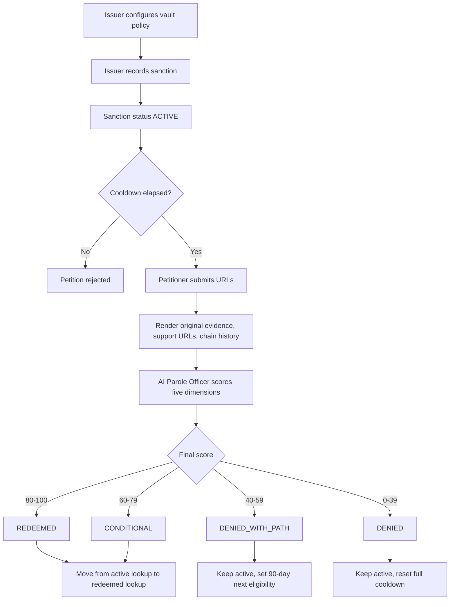

# ChronoVault Architecture

ChronoVault is a GenLayer Intelligent Contract protocol for time-bound reputation sanctions. It preserves historical accountability while allowing a sanctioned address to petition for a transparent AI redemption verdict after a cooldown period.

The design is intentionally storage-simple for GenLayer Studio compatibility. Public method signatures use only supported primitive or GenLayer container types, while complex records are JSON-encoded strings stored in `TreeMap` fields.

## Contract Boundary

The main contract is `contracts/chronovault.py`, with the Studio entry point named exactly:

```python
class Contract(gl.Contract):
```

The contract owns five major responsibilities:

1. Configure issuer authority and vault policy.
2. Record sanctions against offender addresses.
3. Enforce petition eligibility and cooldown rules.
4. Run nondeterministic evidence review through GenLayer web rendering and prompt execution.
5. Store permanent verdict history without deleting the original sanction record.

The contract does not include a frontend, off-chain indexer, or DAO voting mechanism. Issuers can integrate DAO governance externally and call the contract after their vote passes.

## Storage Model

GenLayer Studio currently rejects nested public structs and ordinary Python `dict` or `list` storage. ChronoVault therefore stores complex records as JSON strings.

### Top-Level Storage

```python
sanctions: TreeMap[u256, str]
address_active_sanctions: TreeMap[Address, DynArray[u256]]
address_redeemed_sanctions: TreeMap[Address, DynArray[u256]]
total_sanctions: u256
total_petitions: u256
vault_config: TreeMap[str, str]
issuer_authority: TreeMap[Address, bool]
```

### Field Purposes

`sanctions` maps each sanction id to a JSON-encoded sanction record. This is the canonical source of truth for both active and redeemed sanctions.

`address_active_sanctions` maps offender addresses to sanction ids currently treated as active or conditionally monitored.

`address_redeemed_sanctions` maps offender addresses to sanction ids that have received `REDEEMED` or `CONDITIONAL` status. A conditionally redeemed sanction remains visible for public risk review.

`total_sanctions` is an auto-incrementing counter. The next sanction id is created by incrementing this value.

`total_petitions` is an auto-incrementing counter for petition history entries.

`vault_config` stores flexible policy values as strings so the contract can evolve without nested config types. Expected keys:

```text
default_cooldown_seconds
conditional_recheck_seconds
denied_with_path_wait_seconds
redeemed_threshold
conditional_threshold
denied_with_path_threshold
```

`issuer_authority` records which addresses may call issuer-only functions such as `record_sanction`, `set_issuer_authority`, and `configure_vault`.

## JSON Records

### Sanction Record

Each sanction is serialized into `sanctions[sanction_id]`.

```json
{
  "id": 1,
  "offender": "0x...",
  "issuer": "0x...",
  "reason": "Rug-pulled DAO treasury",
  "original_evidence_url": "https://...",
  "severity": 4,
  "sanctioned_at": 1710000000,
  "cooldown_seconds": 15552000,
  "status": "ACTIVE",
  "next_eligible_at": 1725552000,
  "latest_petition_id": 0,
  "redemption_history": []
}
```

Supported sanction statuses:

```text
ACTIVE
REDEEMED
CONDITIONAL
PETITION_DENIED
```

`PETITION_DENIED` means a petition failed, but the sanction is still active for lookup purposes.

### Petition Record

Each petition is appended to the sanction JSON record under `redemption_history`.

```json
{
  "petition_id": 1,
  "petitioner": "0x...",
  "supporting_urls": ["https://...", "https://..."],
  "chain_history_url": "https://...",
  "petitioned_at": 1740000000,
  "verdict": "DENIED_WITH_PATH",
  "redemption_score": 52,
  "scores_breakdown": {
    "behavioral_change": 60,
    "restitution": 35,
    "consistency": 55,
    "severity_discount": 40,
    "recidivism_risk": 45
  },
  "specific_evidence_cited": ["Observed sustained open-source contributions since May 2025"],
  "required_actions_if_denied_with_path": ["Publish verifiable restitution plan with payment receipts"],
  "ai_reasoning": "The evidence shows some positive behavior, but restitution is incomplete.",
  "next_eligible_at": 1747776000,
  "appealed": false
}
```

Supported verdicts:

```text
REDEEMED
CONDITIONAL_REDEMPTION
DENIED_WITH_PATH
DENIED
```

## Public API

All public signatures avoid `float`, ordinary `list`, ordinary `dict`, custom classes, and nested complex types.

### Issuer and Config Methods

```python
set_issuer_authority(issuer: Address, allowed: bool) -> str
configure_vault(key: str, value: str) -> str
get_config(key: str) -> str
is_issuer(address: Address) -> bool
```

`set_issuer_authority` is issuer-only after initialization. During first deployment, the deploying caller is expected to be seeded as an issuer in `__init__` if the GenLayer caller object is available. If caller seeding is uncertain in Studio, the contract should include a TODO rather than guessing an unsupported API.

### Sanction Methods

```python
record_sanction(
    offender_address: Address,
    reason: str,
    evidence_url: str,
    severity: u8,
    timestamp: u256
) -> u256
```

`severity` is expected to be `1` through `5`. `timestamp` is passed by the caller as Unix seconds to avoid depending on an uncertain chain time API.

### Petition Methods

```python
petition_for_redemption(
    sanction_id: u256,
    supporting_urls: DynArray[str],
    chain_history_url: str,
    petitioned_at: u256
) -> str
```

The return value is the JSON-encoded petition record. The contract also mutates the sanction record and lookup maps according to the verdict.

All calls to `gl.nondet.web.render()` and `gl.nondet.exec_prompt()` are wrapped inside `gl.vm.run_nondet_unsafe()`.

### Governance Appeal

```python
appeal_verdict(
    sanction_id: u256,
    appeal_reason: str,
    appealed_at: u256
) -> str
```

Issuer-only. An appeal runs a stricter re-evaluation against the same original sanction and latest petition evidence. Only one appeal is allowed per latest redemption petition.

### Lookup Methods

```python
check_address_status(address: Address) -> str
get_sanction(sanction_id: u256) -> str
get_sanction_history(address: Address) -> str
get_redemption_verdict(sanction_id: u256) -> str
```

`get_sanction_history` returns a JSON string containing active and redeemed sanction ids plus embedded sanction records where feasible.

## Lifecycle



## Verdict Matrix

| Score Range | Verdict | Address Status | Next Petition |
| --- | --- | --- | --- |
| 80-100 | `REDEEMED` | Removed from active blacklist, history stamped redeemed | Not needed unless re-sanctioned |
| 60-79 | `CONDITIONAL_REDEMPTION` | Removed from active blacklist, visible as conditional | Recheck after 90 days |
| 40-59 | `DENIED_WITH_PATH` | Still active | Eligible after 90 days |
| 0-39 | `DENIED` | Still active | Eligible after full cooldown |

## Scoring Formula

The AI is required to return all five dimensions as integers from `0` to `100`. The contract recomputes the final score using integer math:

```text
final =
  behavioral_change * 30 / 100
+ restitution * 25 / 100
+ consistency * 25 / 100
+ severity_discount * 10 / 100
+ (100 - recidivism_risk) * 10 / 100
```

The contract should prefer its recomputed score over the model-provided `final_redemption_score` to keep verdict thresholds deterministic.

## Evidence Model

The petition review includes:

1. Original sanction evidence URL.
2. Supporting URLs provided by the petitioner.
3. Chain history hint URL provided by the petitioner.

The prompt forbids the AI from relying on facts it did not observe in the rendered evidence. The validator function for nondeterministic execution should verify that a result exists and is shaped as a GenLayer VM return. It should not attempt moral re-judgment inside the validator.

## Security and Abuse Considerations

Issuer abuse is reduced by explicit issuer authority checks, but not eliminated. DAO governance should manage issuer membership off-contract.

Petition spam is controlled through `next_eligible_at`, full cooldowns for low-scoring denials, and shorter 90-day waits for `DENIED_WITH_PATH`.

AI over-leniency is mitigated through issuer appeals, stricter appeal prompts, one appeal per petition, and permanent storage of full reasoning.

AI hallucination risk is mitigated by prompt constraints requiring specific cited evidence from rendered URLs and prohibiting external assumptions.

History is never erased. Redemption changes active status and labeling only.

## GenLayer Studio Compatibility Checklist

Every `.py` contract must satisfy these constraints:

```text
Line 1: # v0.2.16
Line 2: # { "Depends": "py-genlayer:1jb45aa8ynh2a9c9xn3b7qqh8sm5q93hwfp7jqmwsfhh8jpz09h6" }
Only import: from genlayer import *
Main class: Contract
No TreeMap() or DynArray() assignments in __init__
No float public signature types
Only supported public method types
Use TreeMap/DynArray for storage
Wrap every gl.nondet.* call in gl.vm.run_nondet_unsafe()
```
